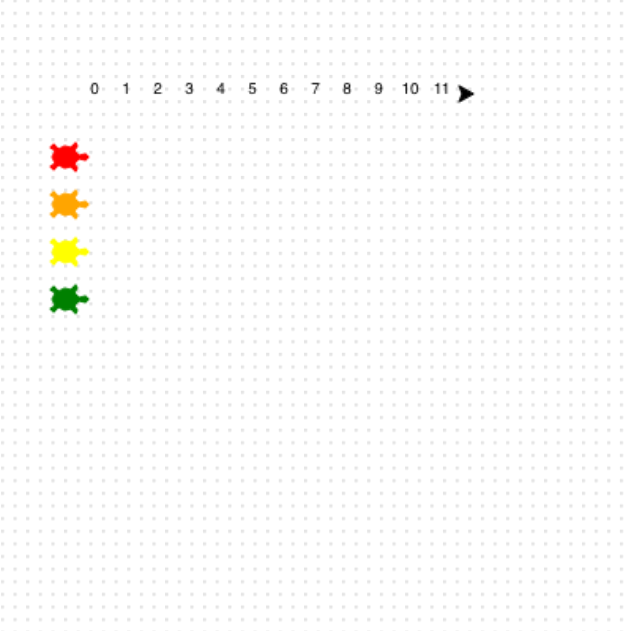

## Number the track

Add number markers along the top of the race track.

**Count the steps! 🔢**

Use a loop to write the numbers `0` to `11`.

After writing each number, move forward to the next spot.

```python filename="main.py" line_numbers="true" line_number_start="36"
for step in range(12):
    write(step, align = 'center')
    forward(20)
```

> [!TIP]
>
> - `range(12)` gives you the numbers `0` to `11`.
> - `write(step)` prints the number on the screen.

> [!DEBUG]
>
> - If all the numbers sit on top of each other, check `forward(20)` is inside the loop.

## Now run your code

Run your code and check that the number line stays at the top and the turtles are still lined up on the left.


