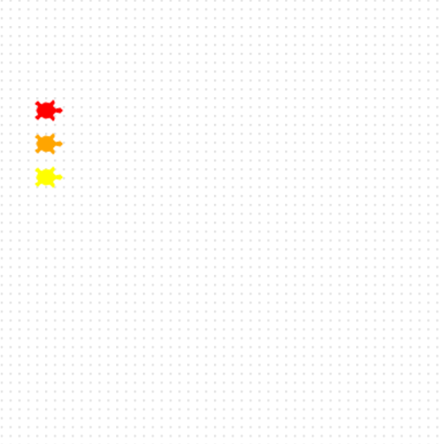

<h2 class="c-project-heading--task">Add a third turtle</h2>

Now your race needs one more turtle.

<h2 class="c-project-heading--explainer">Hello, Eve! 🐢</h2>

--- task ---

Create a turtle named `eve`.

Give Eve a colour and shape, then move her to the starting line below Bob.

--- /task ---

--- code ---
---
language: python
filename: main.py
line_numbers: true
line_number_start: 18
line_highlights: 18, 19, 22
---
eve = Turtle()
eve.color('yellow')
eve.shape('turtle')
eve.penup()
eve.goto(-160, 40)
eve.pendown()
--- /code ---

### Tip

- `shape('turtle')` makes sure your turtle looks like a turtle.
- Try a different colour for `eve` if you want.

### Debugging

- Make sure you used `eve` in every line for this turtle.

