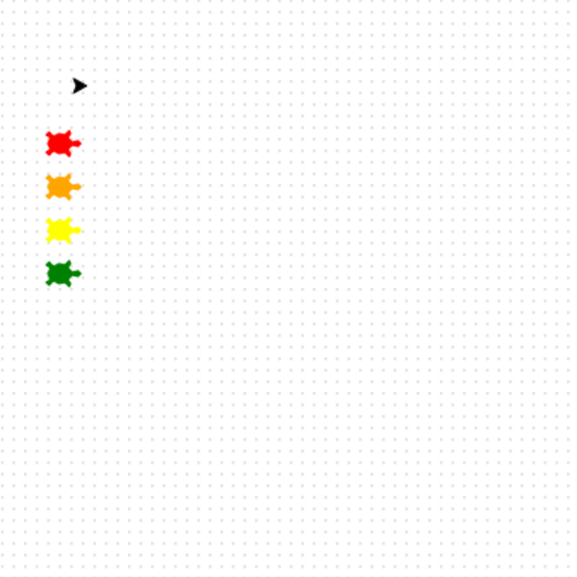

<h2 class="c-project-heading--task">Get the track pen ready</h2>

Now set up the turtle that will draw the race track. This will just have the basic arrow shape when it draws.

<h2 class="c-project-heading--explainer">Ready, set, draw! ✏️</h2>

--- task ---

Lift the pen so no line is drawn.

Move to the top-left corner of the track and make the turtle move fast.

--- /task ---

--- code ---
---
language: python
filename: main.py
line_numbers: true
line_number_start: 32
line_highlights:
---
penup()
goto(-140, 140)
speed(10)
--- /code ---

### Tip

- `speed(10)` makes drawing faster so you do not have to wait.
- `goto(-140, 140)` moves to the top-left corner of the track.

### Debugging

- If you see a line, make sure `penup()` comes before `goto()`.

