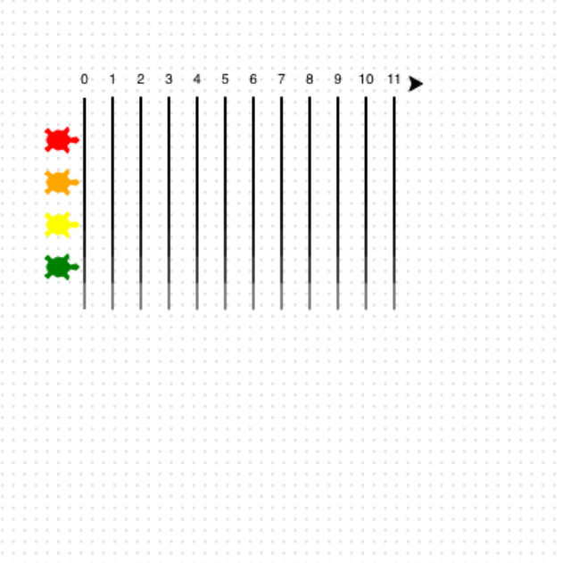

<h2 class="c-project-heading--task">Draw the race markers</h2>

Add the race markers under each number.

<h2 class="c-project-heading--explainer">Make the track! 🏁</h2>

--- task ---

Inside the loop, turn and draw a line down for each marker.

Then move back up, face forward again, and write the next number.

--- /task ---

--- code ---
---
language: python
filename: main.py
line_numbers: true
line_number_start: 36
line_highlights: 38-44
---
for step in range(12):
    right(90)
    forward(10)
    pendown()
    forward(150)
    penup()
    backward(160)
    left(90)
    write(step, align = 'center')
    forward(20)
--- /code ---

### Tip

- `pendown()` starts drawing the lane markers.
- `penup()` lifts the pen so you can move without drawing.

### Debugging

- If your lines go the wrong way, check the `right(90)` and `left(90)` turns.

