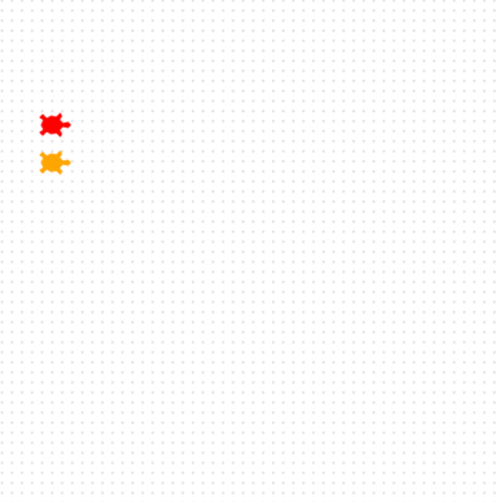

<h2 class="c-project-heading--task">Ajouter une autre tortue</h2>

Ajoute une deuxième tortue rapide à ta course.

<h2 class="c-project-heading--explainer">Voici Bob ! 🐢</h2>

Crée une nouvelle tortue qui s'appelle `Bob`.

Définis la couleur et la forme de Bob, puis déplace-le vers la prochaine position de départ.

Bob ressemble beaucoup à Ada. Seuls la couleur et la position changent. Les traits importants qui distinguent Bob sont mis en évidence.

--- code ---
---
language: python
filename: main.py
line_numbers: true
line_number_start: 11
line_highlights: 11, 12, 15
---
bob = Turtle()
bob.color('orange')
bob.shape('turtle')
bob.penup()
bob.goto(-160, 70)
bob.pendown()
--- /code ---

### Astuce

- Tu peux choisir le nom de couleur que tu souhaites pour `Bob`.
- `penup()` empêche la tortue de tracer une ligne pendant qu'elle se déplace.

### Débogage

- Vérifie que `Bob` a une couleur entre guillemets, comme `'orange'`.

## Exécute maintenant ton code

Exécute ton code et vérifie que deux tortues sont alignées à gauche, l'une au-dessus de l'autre.
