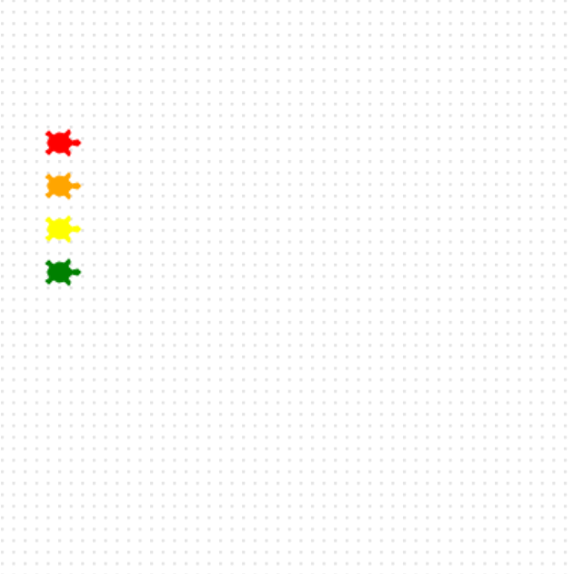

<h2 class="c-project-heading--task">Ajouter la quatrième tortue</h2>

Chaque course nécessite une liste complète de participant·e·s.

<h2 class="c-project-heading--explainer">Voici Kai ! 🐢</h2>

Crée une tortue appelée `Kai`.

Définis la couleur et la forme, puis déplace Kai vers la dernière position de départ.

--- code ---
---
language: python
filename: main.py
line_numbers: true
line_number_start: 25
line_highlights: 25, 26, 29
---
kai = Turtle()
kai.color('green')
kai.shape('turtle')
kai.penup()
kai.goto(-160, 10)
kai.pendown()
--- /code ---

### Astuce

- Donne à `Kai` une couleur qui se démarque des autres.
- Chaque tortue occupe une position Y différente afin qu'elles ne se chevauchent pas.

### Débogage

- Vérifie que `goto(-160, 10)` utilise une virgule entre x et y.

## Exécute maintenant ton code

Exécute ton code et vérifie que quatre tortues sont alignées à gauche.
