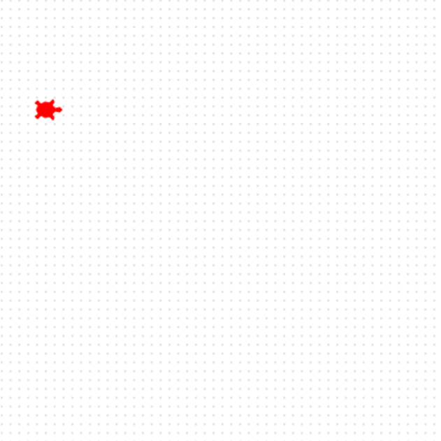

<h2 class="c-project-heading--task">Voeg een schildpad toe</h2>

Maak je eerste schildpad en zet hem aan startlijn.

<h2 class="c-project-heading--explainer">Maak kennis met Ada! 🐢</h2>

Zet de eerste schildpad op het scherm.

Je kunt de schildpad elke naam geven die je wilt. Wij hebben hem 'ada' genoemd.

Geef deze schilpad een kleur en vorm, zet hem op de startpositie.

--- code ---
---
language: python
filename: main.py
line_numbers: true
line_number_start: 4
line_highlights: 4-9
---
ada = Turtle()
ada.color('red')
ada.shape('turtle')
ada.penup()
ada.goto(-160, 100)
ada.pendown()
--- /code ---

### Tip

- Kies zelf een kleur voor de schildpad.
- Met `goto` worden de `x` en `y` positie van de schildpad op het scherm ingesteld.

### Foutopsporing

- Zorg ervoor dat je de kleur tussen aanhalingstekens zet - "red" (rood)

## Voer nu je code uit

Voer je code uit en controleer of er één schildpad aan de linkerkant van het scherm verschijnt.
