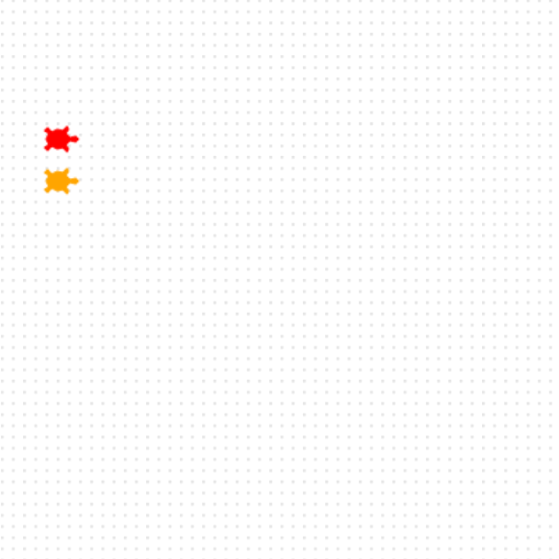

## Add another turtle

Voeg een tweede snelle schildpad toe aan de race.

**Meet Bob! 🐢**

Maak een nieuwe schildpad met de naam `bob`.

Geef Bob een kleur en vorm en zet hem op de volgende startpositie

Bob lijkt heel veel op Ada. Alleen de kleur en de positie zijn anders. De belangrijkste eigenschappen die Bob uniek maken, zijn gemarkeerd.

```python filename="main.py" line_numbers="true" line_number_start="11" line_highlights="11,12,15"
bob = Turtle()
bob.color('orange')
bob.shape('turtle')
bob.penup()
bob.goto(-160, 70)
bob.pendown()
```

> [!TIP]
>
> - Geef 'bob' een kleur naar keuze.
> - Met `penup()` beweegt de schildpad zonder een lijn te tekenen.

> [!DEBUG]
>
> - Controleer of `bob` een kleur tussen aanhalingstekens heeft, zoals `'orange'`.

## Voer nu je code uit

Voer je code uit: staan beide schildpadden links en netjes boven elkaar?


