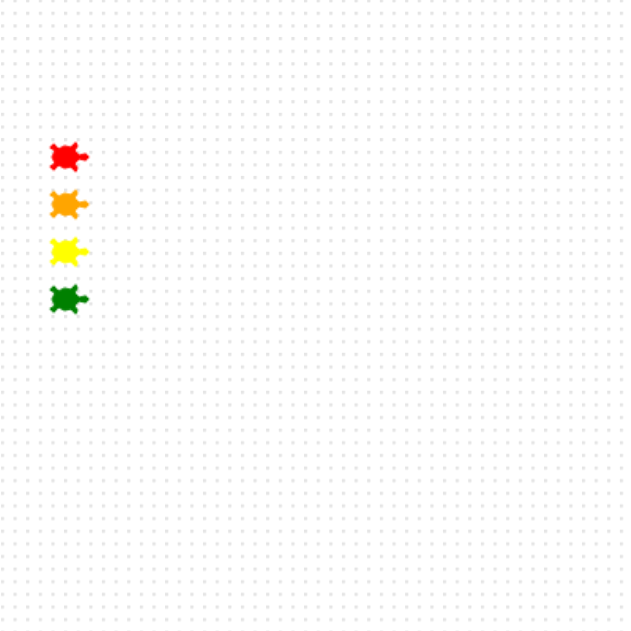

## Add the fourth turtle

Maak het startveld compleet.

**Say hi to Kai! 🐢**

Maak een schildpad met de naam `kai`.

Geef Kai een kleur en vorm en zet hem op de laatste startpositie

```python filename="main.py" line_numbers="true" line_number_start="25" line_highlights="25,26,29"
kai = Turtle()
kai.color('green')
kai.shape('turtle')
kai.penup()
kai.goto(-160, 10)
kai.pendown()
```

> [!TIP]
>
> - Geef `kai` een kleur die eruit springt.
> - Elke schildpad staat op een andere y-positie, zodat ze elkaar niet overlappen.

> [!DEBUG]
>
> - Controleer of er een komma staat tussen x en y in `goto(-160, 10)`.

## Voer nu je code uit

Voer je code uit: staan alle vier schildpadden links en netjes boven elkaar?


