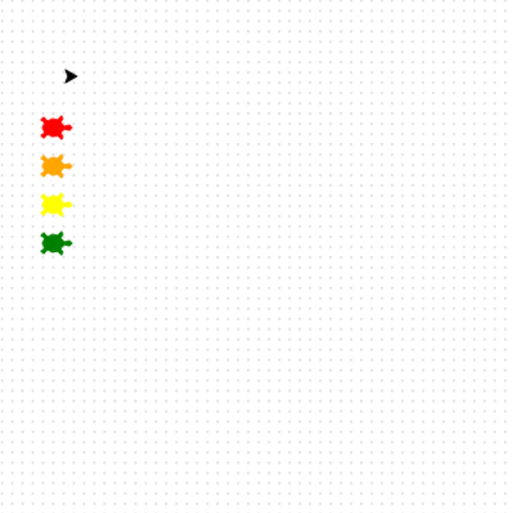

## Get the track pen ready

Maak nu de schildpad die de racebaan tekent.

**Ready, set, draw! ✏️**

Deze schildpad heeft de vorm van een simpele pijl.

Til de pen op zodat er geen lijn wordt getrokken.

Ga naar de linkerbovenhoek van de baan en laat de schildpad snel bewegen.

```python filename="main.py" line_numbers="true" line_number_start="32"
penup()
goto(-140, 140)
speed(10)
```

> [!TIP]
>
> - Versnel het tekenen met `speed(10)`, zodat je niet hoeft te wachten.
> - Met `goto(-140, 140)` gaat het naar de linkerbovenhoek van de baan.

> [!DEBUG]
>
> - Als je een lijn ziet, zorg er dan voor dat `penup()` vóór `goto()` komt.

## Voer nu je code uit

Run your code and check that the cursor is in the correct position.


