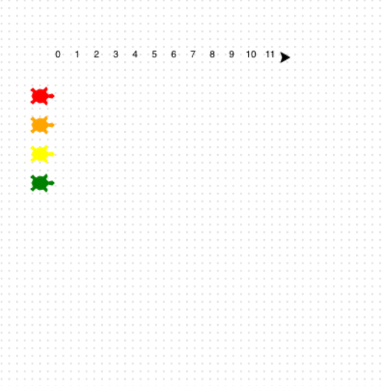

<h2 class="c-project-heading--task">Geef de baan een nummer</h2>

Zet nummermarkeringen bovenaan de baan.

<h2 class="c-project-heading--explainer">Tel de stappen! 🔢</h2>

Gebruik een lus om de getallen `0` tot en met `11` te schrijven.

Ga na elk nummer naar de volgende positie.

--- code ---
---
language: python
filename: main.py
line_numbers: true
line_number_start: 36
line_highlights:
---
for step in range(12):
    write(step, align = 'center')
    forward(20)
--- /code ---

### Tip

- `range(12)` geeft je de getallen `0` tot en met `11`.
- `write(step)` print het getal op het scherm.

### Foutopsporing

- Als alle getallen bovenop elkaar staan, controleer dan of `forward(20)` zich binnen de lus bevindt.

## Voer nu je code uit

Voer je code uit en controleer of de getallenlijn bovenaan blijft en de schildpadden nog steeds aan de linkerkant op een rij staan.
