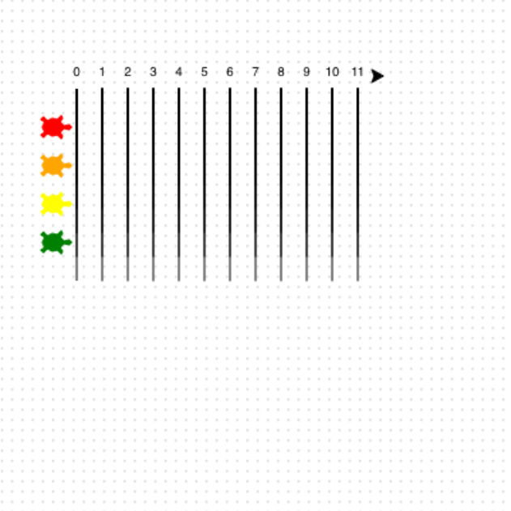

## Draw the race markers

Plaats de racemarkeringen onder elk nummer.

**Make the track! 🏁**

Binnen de lus laat je de pijl-schildpad draaien en trek je voor elke markering een lijn naar beneden.

Zet de schildpad weer bovenaan met zijn gezicht naar voren en schrijf het volgende getal.

```python filename="main.py" line_numbers="true" line_number_start="36" line_highlights="38-44"
for step in range(12):
    right(90)
    forward(10)
    pendown()
    forward(150)
    penup()
    backward(160)
    left(90)
    write(step, align = 'center')
    forward(20)
```

> [!TIP]
>
> - `pendown()` start het tekenen van de baanmarkeringen.
> - `penup()` tilt de pen op, zodat je kunt bewegen zonder te tekenen.

> [!DEBUG]
>
> - Als jouw lijnen de verkeerde kant op gaan, controleer dan de bochten naar rechts (`right(90)`) en naar links (`left(90)`).

## Voer nu je code uit

Voer je code uit en controleer of er verticale ljnen voor de banen onder de nummers worden getekend.


