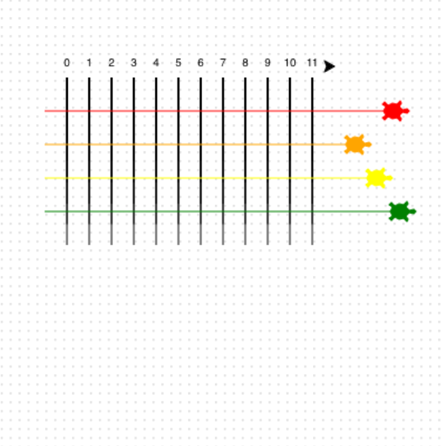

<h2 class="c-project-heading--task">Start de race</h2>

Laat de schildpadden elke beurt een willekeurige afstand vooruit bewegen.

<h2 class="c-project-heading--explainer">Laat ze racen! 🐢🐢🐢🐢</h2>

Gebruik een lus voor 100 beurten.

Verplaats elke schildpad bij elke beurt een willekeurig aantal stappen vooruit.

--- code ---
---
language: python
filename: main.py
line_numbers: true
line_number_start: 47
line_highlights:
---
for turn in range(100):
    ada.forward(randint(1,5))
    bob.forward(randint(1,5))
    eve.forward(randint(1,5))
    kai.forward(randint(1,5))
--- /code ---

### Tip

- `randint(1,5)` kiest een willekeurig getal tussen 1 en 5.
- Hoe groter het getal, hoe verder een schildpad per beurt beweegt.

### Foutopsporing

- Als je een foutmelding ziet, controleer dan of je `randint(1,5)` met haakjes en een komma hebt geschreven.

## Voer nu je code uit

Voer je code uit en controleer of de schildpadden over de baan beginnen te bewegen.
