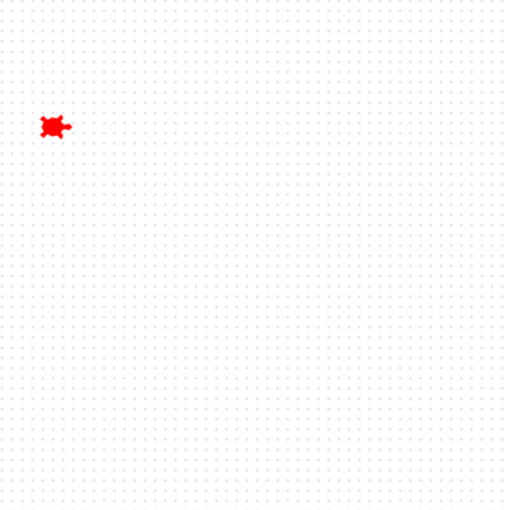

## Add a turtle

Створи свою першу черепаху, та підготуй її до перегонів на старті.

**Say hello to Ada! 🐢**

Для початку, додай черепаху на екран.

Ти можеш назвати черепаху як тобі заманеться. Зараз її ім'я `ада`.

Черепаха отримає колір та форму і потім йде на стартову позицію.

```python filename="main.py" line_numbers="true" line_number_start="4" line_highlights="4-9"
ada = Turtle()
ada.color('red')
ada.shape('turtle')
ada.penup()
ada.goto(-160, 100)
ada.pendown()
```

> [!TIP]
>
> - Ти можеш змінити колір черепахи на який тобі подобається.
> - `goto` налаштовує точки `x` та `y`, розташовуючи черепаху на екрані.

> [!DEBUG]
>
> - Не забудь поставити колір у лапки - `'червоний'`

## Тепер, запускай свій код

Запусти свій код, та поглянь, як на екрані, ліворуч, з'являться черепаха.


