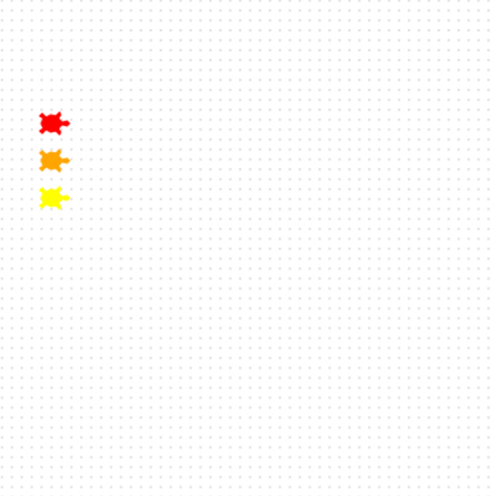

## Add a third turtle

Перегонам потрібна ще одна черепаха.

**Hello, Eve! 🐢**

Створи черепаху на ім'я `eve`.

Задай Єві [колір](https://www.tcl-lang.org/man/tcl8.5/TkCmd/colors.htm) та форму і потім, постав її на старт, нижче Боба.

```python filename="main.py" line_numbers="true" line_number_start="18" line_highlights="18,19,22"
eve = Turtle()
eve.color('yellow')
eve.shape('turtle')
eve.penup()
eve.goto(-160, 40)
eve.pendown()
```

> [!TIP]
>
> - `форма('черепахи')` переконайся що твоя черепаха схожа на черепаху.
> - Обери інший колір для `єви `, якщо хочеш.

> [!DEBUG]
>
> - Якщо ти копіюєш код, зміни ім'я на `eve `для цієї черепахи.

## Тепер, запускай свій код

Запусти свій код, та переконайся що три черепахи вишукувались ліворуч.


