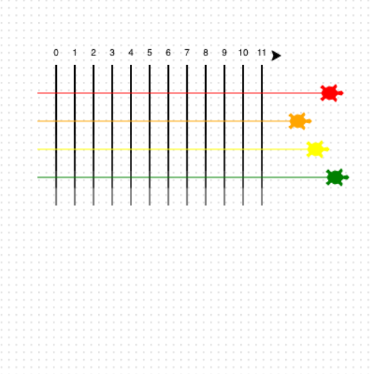

## Start the race

Налаштуй рух черепах вперед на випадкову відстань за крок.

**Let them race! 🐢🐢🐢🐢**

Скористайся циклом, щоб отримати 100 повторів.

Кожен крок, всі черепахи рухаються вперед на випадкову відстань.

```python filename="main.py" line_numbers="true" line_number_start="47"
for turn in range(100):
    ada.forward(randint(1,5))
    bob.forward(randint(1,5))
    eve.forward(randint(1,5))
    kai.forward(randint(1,5))
```

> [!TIP]
>
> - `randint(1,5)` задає випадкове число від 1 до 5.
> - Що більше число, то далі йтиме черепаха кожен раз.

> [!DEBUG]
>
> - Якщо ти бачиш помилку, перевір, чи написав ти `randint(1,5)` в дужках та з комою.

## Тепер, запускай свій код

Запусти свій код та дивись, як черепахи рухаються треком.


